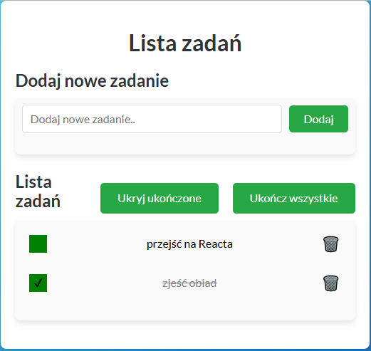

# 🎯 Task List 📝

## 📄 Description

Task List is a simple React application for managing a to-do list. It allows users to add, remove, and mark tasks as completed. The project was initialized using [Create React App](https://github.com/facebook/create-react-app), making development and deployment easier.

## 💻 Technologies Used

- **HTML**: Defines the structure and content of the web/app.
- **CSS**: Styles the appearance of the web/app.
- **JavaScript**: Adds interactivity and dynamic functionality to the web/app.
- **React**: The powerful JavaScript library for building the user interface.
- **Redux Toolkit**: Manages the global state of the application efficiently.

## 🚀 Demo

You can try out the app live here:  
[Task List Demo](https://gyrletta.github.io/todo-list-react/)

## 📸 Application Preview

## 🛠️ Getting Started with Create React App

This project was bootstrapped with [Create React App](https://github.com/facebook/create-react-app).

#### Available Scripts

In the project directory, you can run:

### 🔧 `npm start`

Runs the app in development mode.  
The page will reload when you make changes.  
You may also see any lint errors in the console.

### 🏗️ `npm run build`

Builds the app for production to the `build` folder.  
It correctly bundles React in production mode and optimizes the build for the best performance.

The build is minified, and the filenames include the hashes.  
Your app is ready to be deployed!  
See the section about [deployment](https://facebook.github.io/create-react-app/docs/deployment) for more information.

### ⚙️ `npm run eject`

**Note: This is a one-way operation. Once you `eject`, you can't go back!**

If you aren't satisfied with the build tool and configuration choices, you can `eject` at any time.  
This command will remove the single build dependency from your project.

It will copy all the configuration files and the transitive dependencies (webpack, Babel, ESLint, etc.) right into your project so you have full control over them.  
All of the commands except `eject` will still work, but they will point to the copied scripts so you can tweak them. At this point, you're on your own.

You don't have to ever use `eject`. The curated feature set is suitable for small and middle deployments, and you shouldn't feel obligated to use this feature. However, we understand that this tool wouldn't be useful if you couldn't customize it when you are ready for it.

## 📫 Contact Me

If you have any questions or suggestions, feel free to reach out:  
[Contact Me](##)
